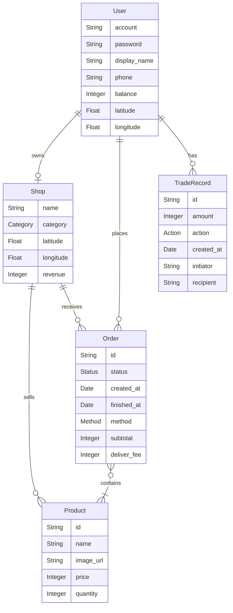

# Entity Relationship Diagram for Database Schema

```mermaid
erDiagram
    User {
        String account
        String password
        String display_name
        String phone
        Integer balance
        Float latitude
        Float longitude
    }
    Shop {
        String name
        Category category
        Float latitude
        Float longitude
        Integer revenue
    }
    Product {
        String id
        String name
        String image_url
        Integer price
        Integer quantity
    }
    Order {
        String id
        Status status
        Date created_at
        Date finished_at
        Method method
        Integer subtotal
        Integer deliver_fee
    }
    TradeRecord {
        String id
        Integer amount
        Action action
        Date created_at
        String initiator
        String recipient
    }

    User ||--o| Shop: owns
    User ||--o{ Order: places
    Shop ||--o{ Product: sells
    Shop ||--o{ Order: receives
    Order }o--|{ Product: contains
    User ||--o{ TradeRecord: has
```
